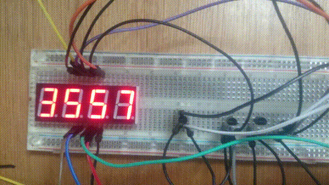

# stm32f103-rtc-7seg
stm32f103 HAL rtc with 7-segment display



CommonCathode 7-segment

| 7-segment pins | stm32f103 pins |
| :------------: | :------------: |
| digit 1    | PA8  |
| digit 2    | PA9  |
| digit 3    | PA10 |
| digit 4    | PA11 |
| segment a  | PA0  |
| segment b  | PA1  |
| segment c  | PA2  |
| segment d  | PA3  |
| segment e  | PA4  |
| segment f  | PA5  |
| segment g  | PA6  |

## How to build
connect stlink/stlinkv2 to debug wire pins and
```
make
make flash
```
